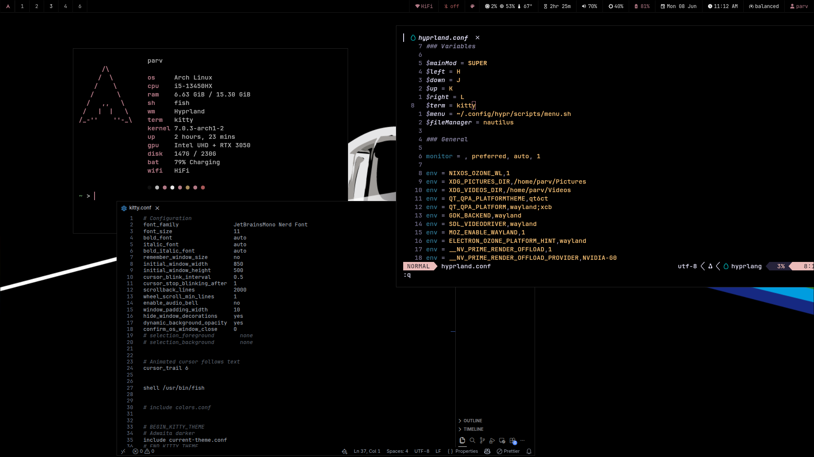
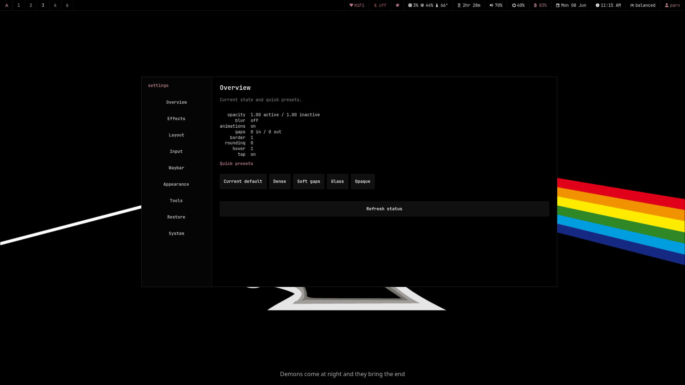
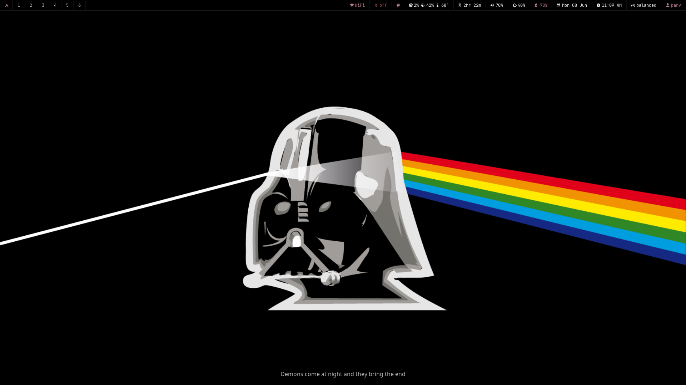

# My Hyprland Dotfiles

Black bar. Sharp text. Fast menus. No giant desktop soup.

This is an Arch + Hyprland setup built around a clean Sway-ish workflow, Kitty + Fish, Rofi menus, Waybar controls, wallpaper-aware colors, and a friendly settings dashboard for people who do not want to live inside config files.







## What You Get

| Area           | Stuff                                                                                                       |
| -------------- | ----------------------------------------------------------------------------------------------------------- |
| Window manager | Hyprland, laptop gestures, hover focus, resize/move bindings                                                |
| Bar            | Waybar with workspaces, vitals, Wi-Fi, Bluetooth, sound, brightness, battery, clock, screenshots, recording |
| Menus          | Rofi launcher, clipboard, wallpaper picker, theme picker, power, audio, network, Bluetooth                  |
| Terminal       | Kitty opens Fish, JetBrains Mono Nerd Font, clean Fastfetch                                                 |
| Themes         | Palette-preview picker, AMOLED mode, wallpaper color extraction, dynamic GTK/Qt app colors                  |
| Dashboard      | Display, layout, blur, opacity, animations, Waybar modules, themes, restore defaults                        |
| Capture        | `grim` + `slurp` screenshots, `satty` or `swappy` editing                                                   |
| Recording      | Native monitor recording, 60 FPS, x264 CRF 8, Opus audio, MKV                                               |

## Quick Controls

| Action                   | Shortcut                           |
| ------------------------ | ---------------------------------- |
| Terminal                 | `Super + Enter`                    |
| App launcher             | `Super + Space`                    |
| Files                    | `Super + E`                        |
| Clipboard                | `Super + V`                        |
| Wallpaper picker         | `Super + Shift + W`                |
| Kill window              | `Super + C`                        |
| Floating                 | `Super + W`                        |
| Fullscreen               | `Super + F`                        |
| Workspaces               | `Super + 1..0`                     |
| Move window to workspace | `Super + Shift + 1..0`             |
| Screenshot menu          | `Fn + PrintScreen` / `PrintScreen` |
| Area screenshot edit     | `Super + PrintScreen`              |

Waybar quick buttons:

- Arch logo opens the dashboard.
- Screenshot button opens the screenshot menu; right click grabs an area.
- Recording button toggles full-screen recording; right click records an area.
- Wi-Fi, Bluetooth, audio, brightness, battery, clock, and power all open matching menus.

## Install

```bash
git clone https://github.com/parv141206/void-dotfiles.git ~/dotfiles
cd ~/dotfiles
./install.sh --dry-run
./install.sh
```

Install common Arch dependencies too:

```bash
./install.sh --packages
```

The installer backs up anything it replaces into:

```text
~/.local/share/hypr-rice/backups/YYYYMMDD_HHMMSS
```

## Main Packages

```text
hyprland hyprpaper hypridle waybar rofi-wayland kitty fish fastfetch nautilus
jq xdg-utils brightnessctl playerctl wireplumber pipewire pipewire-pulse
networkmanager bluez bluez-utils power-profiles-daemon wl-clipboard cliphist
grim slurp satty swappy wf-recorder python-gobject gtk4
qt5ct qt6ct kvantum ttf-jetbrains-mono-nerd noto-fonts
xdg-desktop-portal-hyprland xdg-desktop-portal-gtk
```

## Recording

Recordings land in:

```text
~/Videos/Recordings
```

Defaults are intentionally crisp:

```text
focused native monitor, 60 FPS, x264, CRF 8, slow preset, Opus audio, MKV
```

Override quality when needed:

```bash
RECORD_FPS=30 RECORD_CRF=12 RECORD_PRESET=medium ~/.config/hypr/scripts/recording.sh full
```

## Screenshots

Screenshots land in:

```text
~/Pictures/Screenshots
```

The screenshot menu supports area, active-window, and full-screen capture with save/copy/edit actions.

## Dynamic App Colors

Changing a theme rewrites Waybar, Rofi, Kitty, GTK 3/4, and Qt colors, then nudges GTK settings so most open apps refresh without logging out. Some apps are stubborn and may need reopening.

## What's Tracked

Curated configs only:

```text
hypr waybar rofi kitty fish fastfetch nvim showcase
mako swaylock fontconfig gtk-3.0 gtk-4.0 qt5ct qt6ct Kvantum
btop cava tmux xdg-desktop-portal
```

Browser profiles, caches, backups, secrets, and random app state stay out of the repo.

## Restore

The dashboard can restore the current default rice from:

```text
~/.config/hypr/defaults
```

So yes, you can break the look while experimenting and still come back home.
